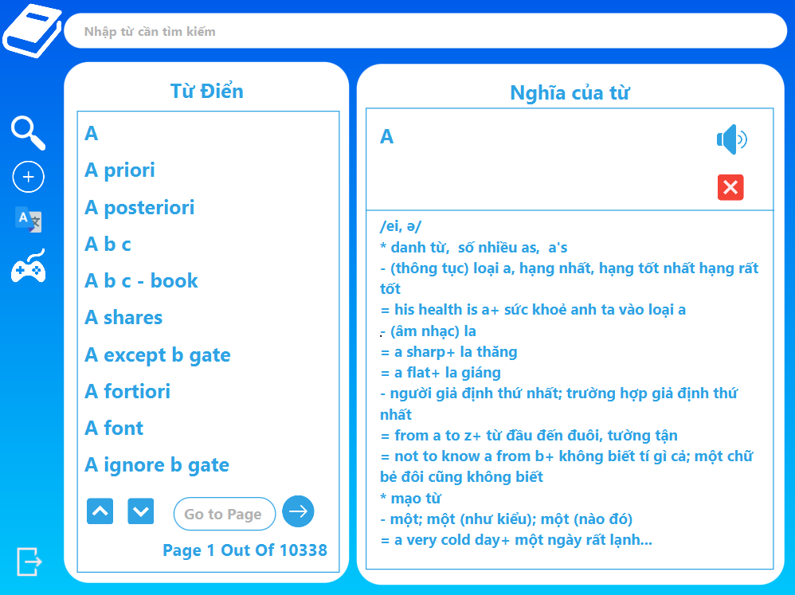

# UET-Dictionary

## Thành viên

- [Trần Tuấn Phong (22028081) - K67CA-CLC4](https://github.com/Hancovirus)
- [Lưu Khải Hưng (22028288) - K67CA-CLC4](https://github.com/luukhaihung22028288)

## Giới thiệu

Bài tập lớn số Từ điển (UET OASIS - 2324I_INT2204_25 - Lập trình hướng đối tượng)

## Tính năng

- Database với 100.000+ từ
- Thêm, sửa, xóa từ
- Tra từ (Áp dụng cây tiền tố Trie)
- Phát âm tiếng anh (Text to speech)
- API google translate Anh <-> Việt
- Game học tiếng anh (Quiz, Hangman)

## Áp dụng

- IntelliJ/Eclipse
- Scene Builder
- JavaFX
- CSS
- Maven
- Voice RSS

## Hướng dẫn sử dụng

**Eclipse:** 
Run as -> Run Configurations
- Main class: application.Main
- Name: JavaFX

Arguements
- VM arguements: --module-path "*Your path to javaFX lib*" --add-modules javafx.controls,javafx.fxml

## Xem trước

